# Introduction

CCAS is designed for biomarker identification by annotating multi-omics level data.
Due to the explosive growth of cancer genome researches and the urgent needs for cancer biomarkers identification, it is becoming increasingly critical and necessary to analyse and annotate multi-omics in cancer patients easily and promptly. The interpretation and analysis of cancer data rely heavily on existing data resources that are often deposited in different data centres or research institutions, which poses a huge challenge to studies involving cancer genome data. 
Here we present CCAS (Cancer genome Consensus Annotation System, https://ngdc.cncb.ac.cn/ccas), one-stop and comprehensive biomarker identification platform for individual cancer genome at multi-omics levels. CCAS integrates 17 widely recognized resources in the field to support data analysis of 10 categories of cancers(395 cancer types are supported in current version of CCAS). Data from each resource are manually curated and standardized by using Ontology frameworks. CCAS accepts mult-omics data incuding SNV/Indels, Expression, CNV, and Methylation level, provides integrated overview and gene-level information to facilitate biomarker identification. Futhermore, CCAS simplifies the input as much as possible and provides a friendly interface for users who are not familiar with genomics and bioinformatics. Outputs are arranged in the forms of tables or figures and can be searched, sorted, and downloaded. Expanded panels with additional information are used for conciseness, and most figures are interactive to show additional information. 

# Data integration

## Ontology framework

In order to integrate multiple data sources, we built two ontology frameworks respectively: ontology of cancers and genes. For the ontology of cancers, we downloaded data from Disease ontology and parsed them by Pronto. The cancer types with MeSH IDs were recursively extracted starting from “cancer” (DOID: 162). MeSH terms corresponding to each cancer were fetched by using NCBI’s E-utilities. For ontology of genes, we retrieved gene IDs from the Ensembl database (release version 104) and converted them to NCBI gene IDs and UCSC gene IDs using HGNC database.
Human protein records were extracted from UniProtKB’s XML file using Python library of BeautifulSoup4. Data in Open Target Platform, DGIdb, CancerMine, and intOGen were downloaded in tabular format. Pathway information along with diagrams were extracted from Reactome database. Data from Cancer Hotspots were converted into VCF format and indexed by Tabix after sorting by chromosomes. For the ClinicalTrials.gov database, NCT ID and other metadata were extracted by Python XML module. After that, clinical trials with drugs were retained. The MeSH terms in clinical trial records were linked to Disease ontology by MeSH IDs. Data in Ensembl, dbNSFP, 1000 Genomes Project , ExAC, gnomAD, and dbSNP were acquired with Ensembl-VEP and ANNOVAR.

## Classify 395 cancer types to 10 categories 

In order to make users find cancer more intuitively, conveniently and quickly, CCAS devides 395 cancers into 10 categories according to its physiological location (Blood, Bone, Glands, Skin, Head and neck, Reproductive system, Thoracic organs, Urinary system, Abdminal organs, Others). The number of cancer types of each category are shown below:

|Category|#Cancer types|
|---|---|
|Abdominal Organs|38|
|Blood|56|
|Bone|16|
|Gland|39|
|Head And Neck Regions|92|
|Other|69|
|Reproductive Organs|41|
|Skin|13|
|Thoracic Organs|17|
|Urinary Organs|14|
|total|395|

## Data sources that integrated in CCAS

To provide high-quality (comprehensive) annotation results, CCAS integrated 17 resources to build the annotation pipeline that was transparent to users. Data in the Genomics module were collected from Ensembl and UniProtKB. For the Disease module, data were integrated from the 1000 Genomes Project, Cancer Hotspots, COSMIC mutational signatures, dbNSFP, dbSNP, ExAC, gnomAD, intOGen, and Reactome. The ClinicalTrials.gov database was used to build the Clinical trial module. The literature module was built mainly in the aid of the CancerMine database. DGIdb and Open Target Platform were used to build the Drug interactions module. Disease ontology, MeSH, Ensembl, and HGNC databases were used to build the ontology frameworks to resolve the heterogeneity when integrating data from multiple resources.

|Name|Description|URL|Note|
|---|---|---|---|
|Clinicaltrials.gov|ClinicalTrials.gov is a resource provided by the U.S. National Library of Medicine. Explore 383,535 research studies in all 50 states and in 220 countries.|https://clinicaltrials.gov/||
|Reactome|REACTOME is an open-source, open access, manually curated and peer-reviewed pathway database. The goal of the database is to provide intuitive bioinformatics tools for the visualization, interpretation and analysis of pathway knowledge to support basic and clinical research, genome analysis, modeling, systems biology and education. Founded in 2003, the Reactome project is led by Lincoln Stein of OICR, Peter D’Eustachio of NYULMC, Henning Hermjakob of EMBL-EBI, and Guanming Wu of OHSU.|https://reactome.org/||
|dbNSFP|dbNSFP is a database developed for functional prediction and annotation of all potential non-synonymous single-nucleotide variants (nsSNVs) in the human genome. Its current version is based on the Gencode release 29 / Ensembl version 94 and includes a total of 84,013,490 nsSNVs and ssSNVs (splicing-site SNVs). It compiles prediction scores from 37 prediction algorithms (SIFT, SIFT4G, Polyphen2-HDIV, Polyphen2-HVAR, LRT, MutationTaster2, MutationAssessor, FATHMM, MetaSVM, MetaLR, CADD, CADD_hg19, VEST4, PROVEAN, FATHMM-MKL coding, FATHMM-XF coding, fitCons x 4, LINSIGHT, DANN, GenoCanyon, Eigen, Eigen-PC, M-CAP, REVEL, MutPred, MVP, MPC, PrimateAI, GEOGEN2, BayesDel_addAF, BayesDel_noAF, ClinPred, LIST-S2, ALoFT), 9 conservation scores (PhyloP x 3, phastCons x 3, GERP++, SiPhy and bStatistic) and other related information including allele frequencies observed in the 1000 Genomes Project phase 3 data, UK10K cohorts data, ExAC consortium data, gnomAD data and the NHLBI Exome Sequencing Project ESP6500 data, various gene IDs from different databases, functional descriptions of genes, gene expression and gene interaction information, etc.|http://database.liulab.science/dbNSFP|embedded in ANNOVAR|
|1000g|The 1000 Genomes Project is a collaboration among research groups in the US, UK, and China and Germany to produce an extensive catalog of human genetic variation that will support future medical research studies. It will extend the data from the International HapMap Project, which created a resource that has been used to find more than 100 regions of the genome that are associated with common human diseases such as coronary artery disease and diabetes. The goal of the 1000 Genomes Project is to provide a resource of almost all variants, including SNPs and structural variants, and their haplotype contexts. This resource will allow genome-wide association studies to focus on almost all variants that exist in regions found to be associated with disease. The genomes of over 1000 unidentified individuals from around the world will be sequenced using next generation sequencing technologies. The results of the study will be publicly accessible to researchers worldwide.|https://www.genome.gov/27528684/1000-genomes-project|embedded in ANNOVAR|
|ExAC|This database has been integreted in gnomAD database |https://gnomad.broadinstitute.org/|embedded in ANNOVAR|
|gnomAD|The Genome Aggregation Database (gnomAD) is a resource developed by an international coalition of investigators, with the goal of aggregating and harmonizing both exome and genome sequencing data from a wide variety of large-scale sequencing projects, and making summary data available for the wider scientific community.|https://gnomad.broadinstitute.org/|embedded in ANNOVAR|
|CancerHotspotsV2|This resource is maintained by the Kravis Center for Molecular Oncology at Memorial Sloan Kettering Cancer Center. It provides information about statistically significantly recurrent mutations identified in large scale cancer genomics data.|https://www.cancerhotspots.org/#/home||
|intOGen|IntOGen is a framework for automatic and comprehensive knowledge extraction based on mutational data from sequenced tumor samples from patients. The framework identifies cancer genes and pinpoints their putative mechanism of action across tumor types.|https://www.intogen.org/search||
|Cosmic Mutational Signatures|"Mutational processes from different aetiologies are active during the course of cancer development. They can be identified using mutational signatures, due to their unique mutational pattern and specific activity on the genome. Illustrated in the figure using a framework of 6 classes of single base substitutions, and three distinct mutational processes, whose respective strengths vary throughout a patient’s life. At the beginning, all mutations were due to the activity of the endogenous mutational process. As time progresses, the other processes get activated and the mutational spectrum of the cancer genome continues to change."|https://cancer.sanger.ac.uk/signatures/||
|CancerMine|CancerMine is a literature-mined database of drivers, oncogenes and tumor suppressors in cancer. It is a valuable resource for cancer researchers and clinicians to understand the genetic underpinnings of different cancer types. The largest bottleneck in precision oncology is interpreting the myriad of mutations found in individual patient tumors. Knowledge of the role of those genes in cancer is essential. This resource provides information on genes that are drivers (frequently harbor cancer-promoting mutations), oncogenes (cancer-promoting) and tumor suppressors (protective against cancer) in a large number of different cancers. Context is key as some genes (e.g. NOTCH1) are oncogenes in one cancer and tumor suppressive in another. All data has been text-mined from articles and the source sentence and links are provided.|http://bionlp.bcgsc.ca/cancermine/||
|DGIdb|The database offer user-friendly browsing, searching, and filtering of information on drug-gene interactions and the druggable genome, mined from over thirty trusted sources. All data can be downloaded freely (except as noted on our Downloads page) or accessed via  API. |https://dgidb.org/||
|Open Target Platform|"The Open Targets Platform is a comprehensive tool that supports systematic identification and prioritisation of potential therapeutic drug targets. By integrating publicly available datasets including data generated by the Open Targets consortium, the Platform builds and scores target-disease associations to assist in drug target identification and prioritisation. It also integrates relevant annotation information about targets, diseases, phenotypes, and drugs, as well as their most relevant relationships."|https://platform.opentargets.org/||
|uniprotkb|"The UniProt Knowledgebase (UniProtKB) is the central hub for the collection of functional information on proteins, with accurate, consistent and rich annotation. In addition to capturing the core data mandatory for each UniProtKB entry (mainly, the amino acid sequence, protein name or description, taxonomic data and citation information), as much annotation information as possible is added. This includes widely accepted biological ontologies, classifications and cross-references, and clear indications of the quality of annotation in the form of evidence attribution of experimental and computational data. The UniProt Knowledgebase consists of two sections: a section containing manually-annotated records with information extracted from literature and curator-evaluated computational analysis, and a section with computationally analyzed records that await full manual annotation. For the sake of continuity and name recognition, the two sections are referred to as ""UniProtKB/Swiss-Prot"" (reviewed, manually annotated) and ""UniProtKB/TrEMBL"" (unreviewed, automatically annotated), respectively."|https://www.uniprot.org/help/uniprotkb||
|Ensembl|Ensembl is a genome browser for vertebrate genomes that supports research in comparative genomics, evolution, sequence variation and transcriptional regulation. Ensembl annotate genes, computes multiple alignments, predicts regulatory function and collects disease data. Ensembl tools include BLAST, BLAT, BioMart and the Variant Effect Predictor (VEP) for all supported species.|https://www.ensembl.org/index.html|embedded in VEP|
|Disease Ontology|"The Disease Ontology has been developed as a standardized ontology for human disease with the purpose of providing the biomedical community with consistent, reusable and sustainable descriptions of human disease terms, phenotype characteristics and related medical vocabulary disease concepts through collaborative efforts of biomedical researchers, coordinated by the University of Maryland School of Medicine, Institute for Genome Sciences. The Disease Ontology semantically integrates disease and medical vocabularies through extensive cross mapping of DO terms to MeSH, ICD, NCI’s thesaurus, SNOMED and OMIM."|https://disease-ontology.org/||
|dbSNP|dbSNP contains human single nucleotide variations, microsatellites, and small-scale insertions and deletions along with publication, population frequency, molecular consequence, and genomic and RefSeq mapping information for both common variations and clinical mutations.|https://www.ncbi.nlm.nih.gov/snp/|embedded in ANNOVAR|
|MeSH|MeSH (Medical Subject Headings) is the NLM controlled vocabulary thesaurus used for indexing articles for PubMed.|https://www.ncbi.nlm.nih.gov/mesh||

## Data annotation pipeline and web server implementation

The annotation pipeline was built using Python and Shell scripts, and running for each user submission on CentOS in command line mode. The pipeline integrated ANNOVAR, Ensembl-VEP, Vcfanno(28), vt(29), and DeconstructSigs(30) to conduct the entire annotation. Because of the varieties of VCF files uploaded by users, CCAS built a pre-processing pipeline running before annotation. In the pre-processing pipeline, firstly, vt was used to left normalize the variants in the user’s VCF file, then split multi-allele variants into different records. Secondly, “Chr” prefix was added if it did not exist. In the annotation pipeline, CCAS used Ensembl-VEP to annotate variants with data from the Ensembl database, and used ANNOVAR to annotate the VCF file with dbNSFP, 1000 Genomes Project, ExAC, gnomAD, and dbSNP database. Vcfanno was used to annotate variants with the Cancer Hotspots database. The information of DGIdb, CancerMine, Reactome, intOGen, Open Target Platform, UniProtKB, and ClinicalTrials.gov databases was stored in MySQL (https://www.mysql.com/) and involved in the annotation of variants at gene level through PyMySQL (https://github.com/PyMySQL/PyMySQL). Then, the mutation signature was calculated using DeconstructSigs with R scripts. Finally, all the results were converted into JavaScript Object Notation (JSON) format for the convenience of web application implementation. If an email address was provided, notifications would be sent when a job starts and finishes.
The web server system used the front-end and back-end separation mode. The back-end used FastAPI to build APIs. MySQL relational database was used for data storage. The front-end pages were constructed using Vue.js (https://vuejs.org/index.html), Vue-router (https://router.vuejs.org/), and Vuex (https://vuex.vuejs.org/index.html). Axios (http://www.axios-js.com/) was used to send Ajax requests to convey data from the back-end. The whole system was deployed in the Nginx server (http://nginx.org/). CentOS (https://www.centos.org/) was used to host pipelines and web applications. 

# Submission

## Submission portal at home page 

CCAS provides a user-friendly interface for user to submit their data. There are two panels in the submission portal. Job title, Notification email are listed at the top of left panel, and are optional. Under job title and email, the user can select the cancer type of the patient. We provide two ways to select cancer types. User can directly retrieve the cancer name or DOID through fuzzy search. Users can also quickly find the type of cancer they want according to different tissue parts below the fuzzy search box. At the right panel, user can choose reference version of the data. Currently, CCAS support both hg19/GRCh37 and hg38/GRCh38. Below the reference version selection box is the place to upload data files. CCAS support mult-omics level data including SNV/Indels, Expression, Copy number variation(CNV), and Methylation. To adopt differnt data type combinations, CCAS **DO NOT** needs data at all levels to run the submission pipeline, Insted, SNV/Indels level data are required,  Expression, Copy number variation(CNV), and Methylation levels data are optional. Demo files are provided for SNV/Indels, Expression, Copy number variation(CNV), and Methylation data respectively. After fill all necessary fields, user can submit the annotation job by click **START** button at the bottom of the portal. If all fields are filled correctly, the succeed message will shown a long with the job id. An email will also be sent to user(if provided). If some errors are occured during the submission or annotation, another email will be sent to user. Finally, An email will be sent when the job is finished.
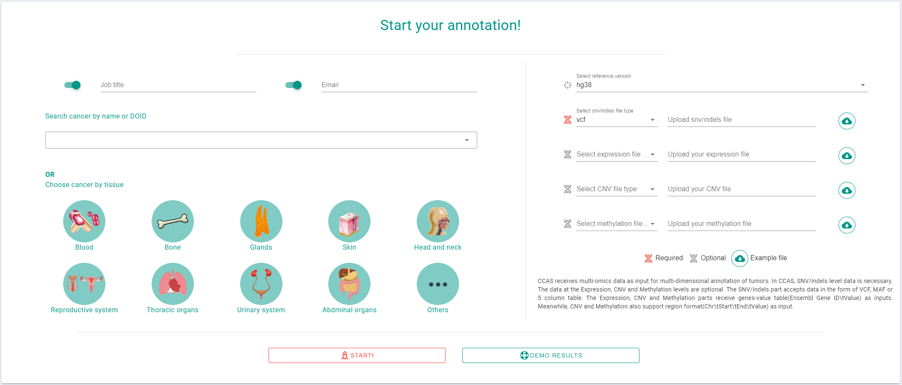

    Notices
    * We highly recommand user provide job title and email for each job.
    * Please provide both file type and the file simultaneously.
    * Only SNV/Indels level data is required.
    * CCAS highly recommends that users upload data after preliminarily filteration.

## Input file formats

### VCF
CCAS support VCF format files as input for SNV/Indels level, the detailed specification can be fount [here](https://docs.gdc.cancer.gov/Data/File_Formats/VCF_Format/)

### MAF
CCAS support MAF format files as input for SNV/Indels level. [Mutation Annotation Format (MAF)](https://docs.gdc.cancer.gov/Data/File_Formats/MAF_Format/) is a tab-delimited text file with aggregated mutation information from VCF Files and are generated on a project-level. 

### 5coltsv
CCAS support 5 column table format files as input for SNV/Indels level. The format is:

>chromsome \t start \t end \t reference_base \t alternative_base

### Gene type

CCAS adopts data in Expression, CNV, and Methylation level in the format like gene ~ value. Below is an example of the format. Please note that TAB are used to seprate columns. The first column is the Ensembl Gene ID and second column is the value. The value column(second column) has various meaning for different level of data. CCAS use the value to help user to filter the annotation results. For Expression level, it may indicate the Expression value, For CNV level, it may indicate the CNV segment ratio. For Methylation level it may indicate the beta-value.

>ENSG00000000457.14 \t 6.1532

### Region type

Another format that accepted by CCAS is the region format. Region format is similar to the bed format, which has 4 columns: chromsome, start, end and value. CCAS uses region format files for CNV and Methylation level data.
>1  \t  25336819  \t  72303233 \t  0.0013

# Results 

## Overview

CCAS provides an overview results for each annotation. Including 5 sections: Disease overview, Mutation Signatures, ssGSEA, Clinical Trials, and Pathways. CCAS provides overview results to facilitate users to have a general overview of the overall profile of patients. Provide a basis for subsequent gene-level biomarker identification.
### Job & Disease Overview

Disease Overview section presents information on multiple levels of job status and disease. Job status includes job title, jobid, submission time, notification email, and files and file types submitted by users. The disease information specified by the user is displayed below. Includes the name of the disease, doid, synonymous names, and other related IDs.

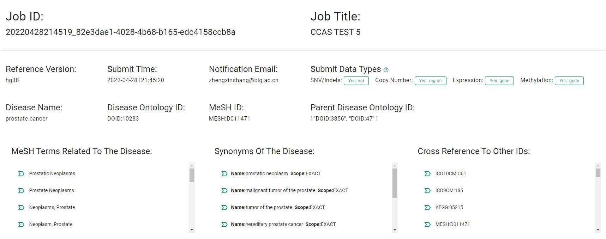

### Mutation Signatures

Mutation signatures can reflect the biological characteristics of tumor by calculating the characteristics of mutation pattern. CCAS provides mutation signatures from SNV/indels data uploaded by users, and compares it with COSMIC signatures.
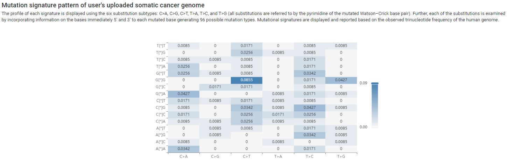
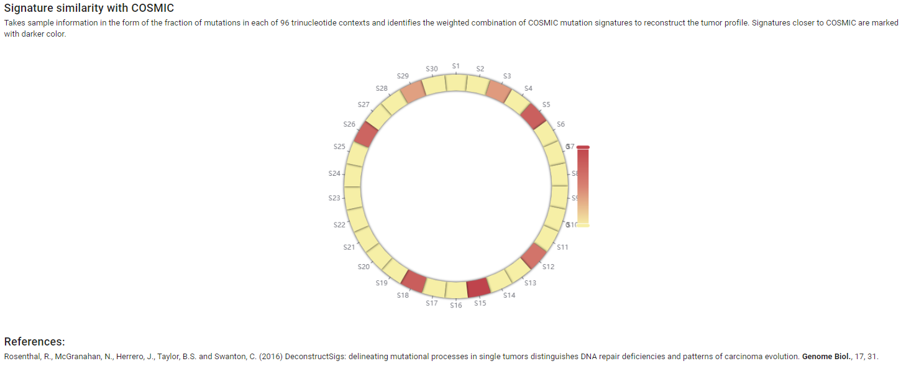

### ssGSEA
Single-sample GSEA (ssGSEA), an extension of Gene Set Enrichment Analysis (GSEA), calculates separate enrichment scores for each pairing of a sample and gene set. Each ssGSEA enrichment score represents the degree to which the genes in a particular gene set are coordinately up- or down-regulated within a sample. If the user provides the data of expression level, CCAS will provide the user with ssGSEA analysis, and the results will be presented in the form of bar plot, as shown in the following figure.
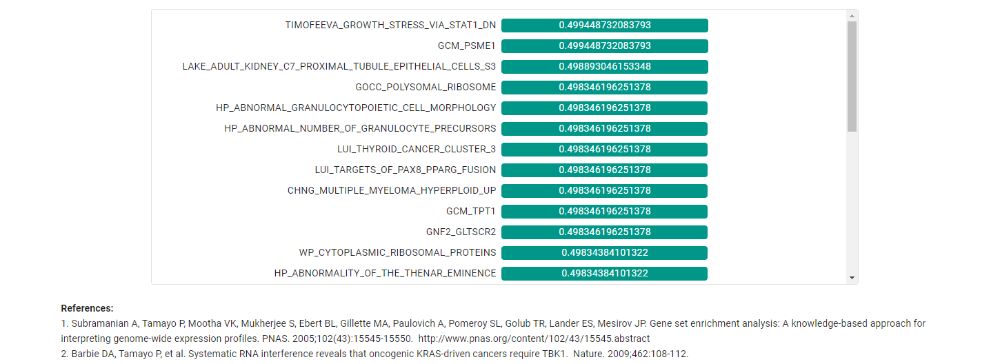

### Clinical trials

CCAs connects the disease with clinical trials by associating DOID with the corresponding MeSH ID. In CCAS, users can retrieve clinical trials that related to the disease. (data of clinical trials are from [ClinicalTrials. Gov](http://clinicaltrials.gov/)). CCAS lists all relevant clinical trials in tabular form. For each clinical trial, CCAS provides the name, introduction, inclusion criteria, intervention, and the corresponding MeSH terms and IDs. At the top of the table, the Filters of the name, clinical trail IDs, intervention and Phase of the clinical trial is provided to facilitate users to quickly find the corresponding clinical trial. CCAS hopes that through this function, users can deepen their understanding of existing clinical trials of  the diseases, be familiar with existing disease-related interventions, and contribute to biomarker's discovery.

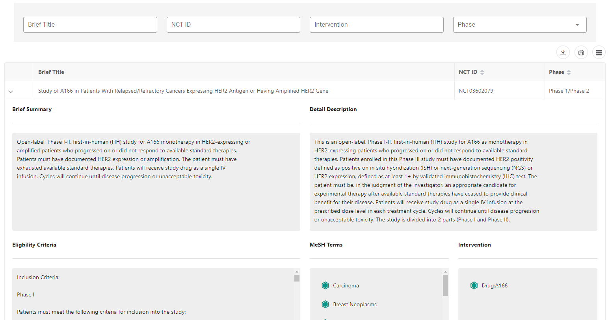

### Pathways

CCAS annotates the genes involved in the uploaded data to the pathway level and provides the user with an overview of the patient's abnormal pathways. The pathways are presented in tabular form, and the information provided includes the name of the pathway, reactome ID, Description, and the corresponding literature. CCAS provides users with convenient and fast filtering functions, which can filter the pathwat name, reactome ID. It can also filter by wether variants were detected in multi-omics data. CCAS hopes to deepen users' understanding of disease-related pathways through this function and contribute to the discovery of biomarker.
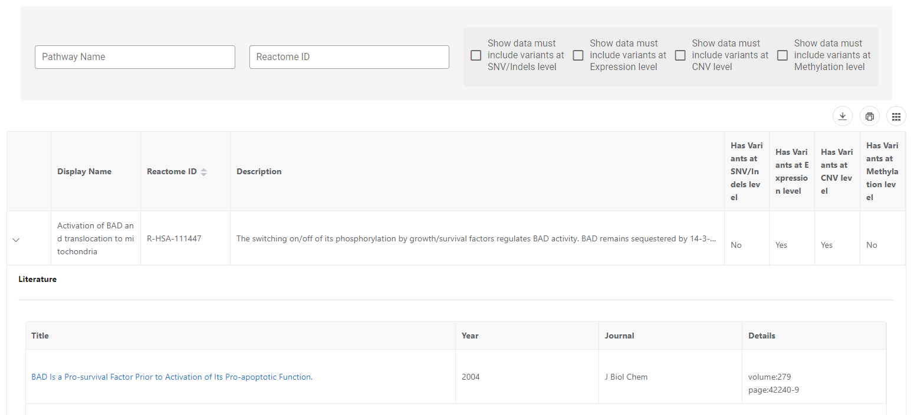

## Gene level annotation

In addition to providing an overview of the disease, CCAS also provides detailed annotation on each gene, which will greatly help users select biomarkers at the gene level. In CCAS, all the data will be annotated to the gene level (using Ensembl gene ID as the ontology framework and HGNC database as the ID conversion database) and then associated with other databases. In this section, CCAS first provides a powerful table to list all annotated genes, and provides comprehensive filter functions to facilitate users to find genes with significant functional changes in patients. Furthermore, CCAS provides a detailed functional introduction of each gene, so that users can find the genes whose functions have changed significantly in patients and are closely related to tumorigenesis and treatment as biomarkers.

### Gene table and filters

#### Gene table
The gene table provided by CCAS is shown in the figure below. The table provides the basic information of genes and the statistics of abnormalities of genes in the multi-omics data uploaded by user, as well as the information of genes in pathways, drug interactions, literature and so on. The meaning of each column is shown in the table below.

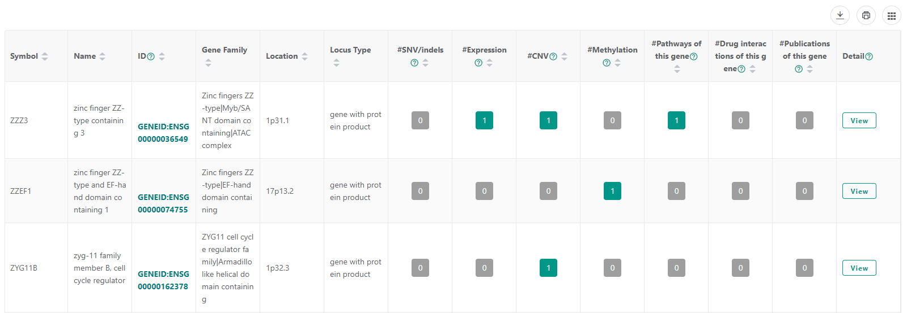

|Column Name|Description|
|:---:|---|
|Symbol| Gene Symbol|
|Name|Gene Name|
|ID|GeneID(The ID is build by adding Prefix 'GENEID:' to Ensembl Gene ID)|
|Gene Family|Description of the gene family|
|Location| Descript the location of the gene in the chromsome|
|Locus Type|The type of gene. This column is retrievaled from HGNC database. Avaliable values are :  RNA, Y ; RNA, long non-coding ; RNA, micro ; RNA, misc ; RNA, ribosomal ; RNA, small nuclear ; RNA, small nucleolar ; RNA, transfer ; RNA, vault ; T cell receptor gene ; T cell receptor pseudogene ; complex locus constituent ; endogenous retrovirus ; gene with protein product ; immunoglobulin gene ; immunoglobulin pseudogene ; protocadherin ; pseudogene ; readthrough ; unknown|
|#SNV/indels| Number of variants of this gene detected in SNV/Indels level data|
|#Expression| Number of variants of this gene detected in Expression level data|
|#CNV| Number of variants of this gene detected in CNV level data|
|#Methylation| Number of variants of this gene detected in Methylation level data|
|#Pathways of this gene|Number of pathways of this gene|
|#Drug interactions of this gene|Number of Drug interactions of this gene, The number is the sum of DGIdb and Open Target Platform|
|#Publications of this gene|Number of Publications describe the relation of this gene and cancers|
|Details|Details of this gene|

#### Gene table filters

Gene table filters are designed for complex filtering of gene table to screen genes with significant functional changes. Filters are divided into four parts, which respectively filter the data at SNV/indels, expression, CNV and methylation levels. The data at SNV/indels level is filtered according to the IMPAC and Consequence annotated by VEP tool. The data at the expression, CNV and methylation levels are filtered according to the corresponding value in the data provided by the user.

### Gene Detail

The gene detail page can display the details of genes and the corresponding abnormalities in the data uploaded by users. Click the `view` button at the end of each row of gene table to open the gene detail page. The gene detail page generated by CCAS is aim to help users evaluate the importance of this gene to tumor, existing researches and corresponding therapeutic drugs when screening biomarker.

#### Gene Basic Information

At the top of the gene detail page is the basic information of the gene, including gene ID in Ensembl, UCSC, Entrez and other databases. The location in the chromosome, locus type of gene, the gene family to which it belongs, the similarity description of protein products with other genes, protein Accessions, PDB ID, the sub-cellular location, and interaction of protein in the cell are shown. At the end of this part, CCAS also provides a detailed description of the function and subunit structure of the gene.

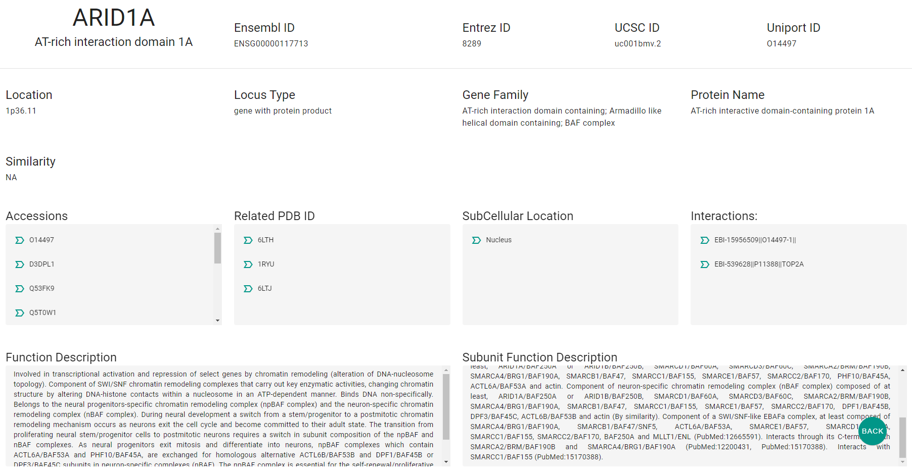

#### Abnormalities in user uploaded data
This section shows the "abnormality" of this gene in the data uploaded by user, including SNV/indels, expression, CNV and methylation.
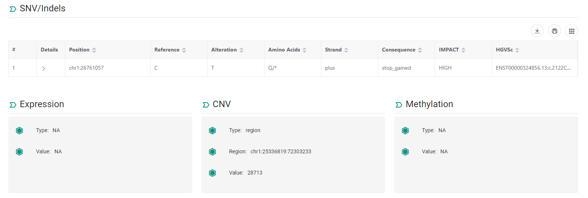

##### SNV/Indels
This part mainly shows the SNV/indels in data uploaded by user. The contents displayed in the table format including the position of variation, reference base, alternative base, amino acid change, strand, IMPACT, Consequence and HGVSc. User can click the details button to open the collapsed content, including the frequency of variation in normal populations, mutation in other cancers and so on.
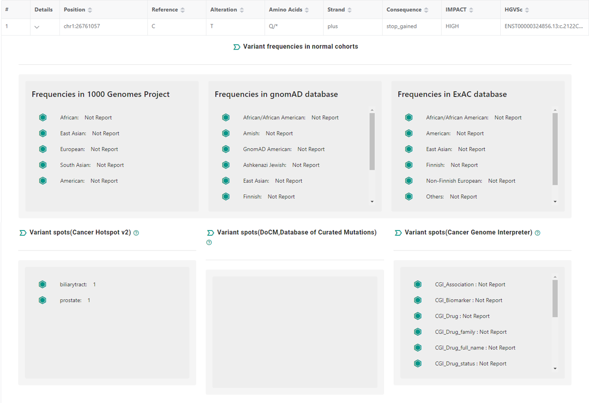

##### Others

In addition to SNV/indels, CCAS also shows the "abnormalities" of the gene at the levels of Expression, CNV and Methylation, as shown in the figure below. 
**Notice: the values here shows the original values in the files uploaded by the user. CCAS will not standardize these values.**
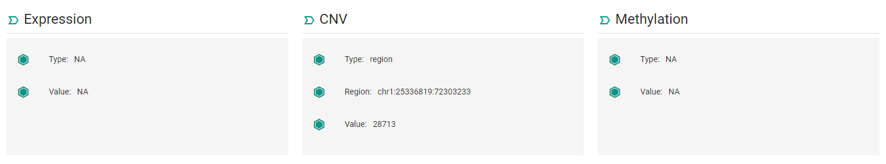

#### Associated pathways

Gene associated pathways shows the pathway information related to this gene recorded in the reactome database. The information is displayed to users in tabular form, including the name of the pathway, ReactomeID, literature related to the pathway, and a description of the pathway. Click the button in the literature section to get the detailed information of the literature. Users can determine whether this gene plays an important role in tumor by browsing the name and function description of the pathway.

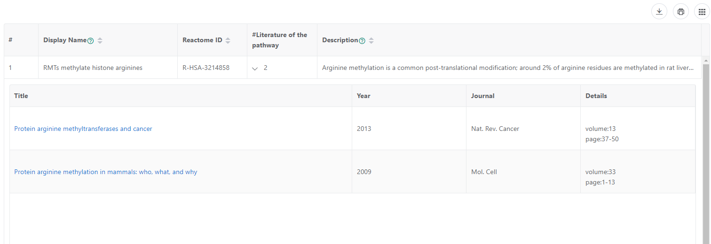

#### Associated cancer cohorts
Gene associated cohorts shows gene mutations in a variety of cancers and cancer cohorts. Through this part, users can know whether this gene is a widely mutated gene in cancers in a fast and convenient way. If this gene is mutated in a variety of cancers, it is likely that this gene is a potential biomarker.

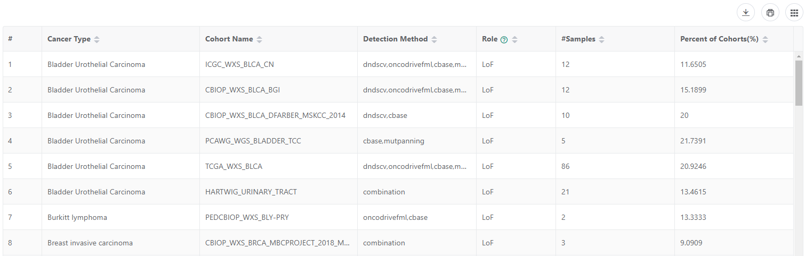

#### Associated Literature
Gene associated literature shows papers on the association of this gene with a variety of cancers. Through this part, users can know the research status of this gene in a variety of cancers. And understand the relationship between specific genes and cancer through the sentences given in the table.

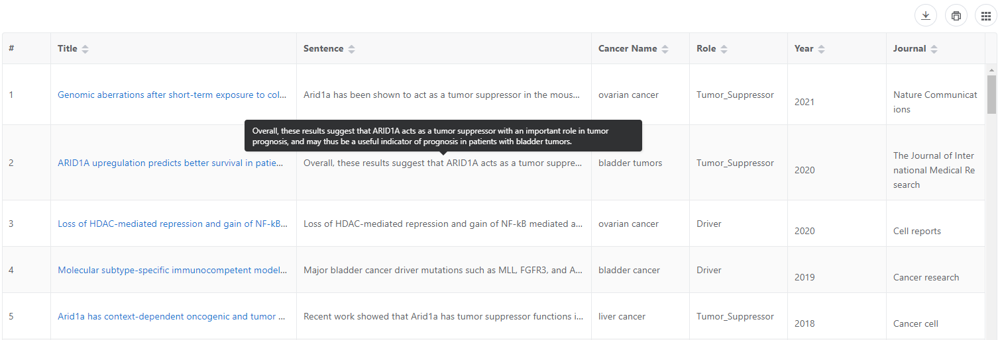

#### Associated Drug interactions
CCAs integrates two databases to describe the interaction between gene and drugs, DGIdb and the Open targe platform. Through this part, users can easily obtain drugs interacting with this gene. Both databases provide drug name and drug ID, which is convenient for users to browse. Dgidb provides an interaction score for each drug-gene relationships. The open target platform provides the disease background when drugs interact with the gene.

**DGIdb**
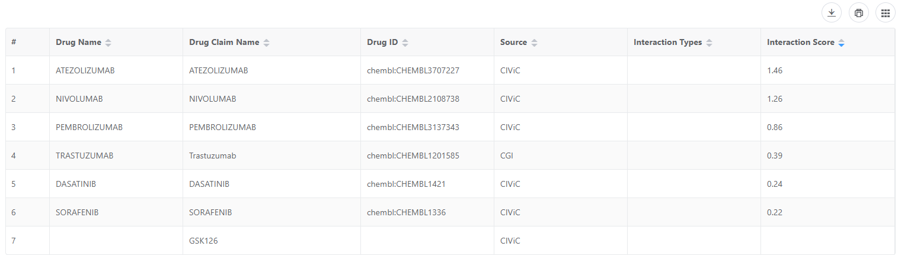

**Open target platform**
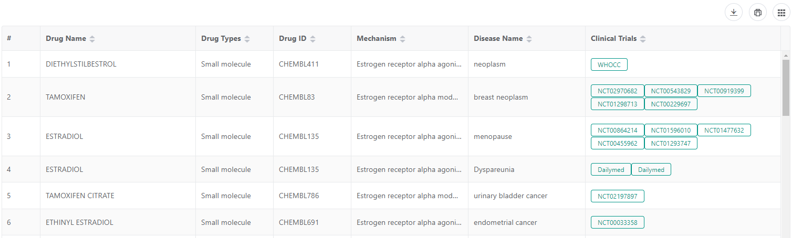

# Disclaimer
CCAS provides the annotation genomic analysis in good faith, but make no warranty, express or implied, nor assume any legal liability or responsibility for non-commerical purpose for which
they are used. The annotation results can not direct use in diagnostic or medical decision-making without interpreted by a genetics professional. If any of the resources are not permitted in our academic non-profit use, please contact us to remove it.

# Contact

    If you would like to learn more about CCAS, please feel free to contact us.

    Email:
    zhengxinchang(AT)big.ac.cn

    Address:
    National Genomics Data Center
    Beijing Institute of Genomics
    Chinese Academy of Sciences
    1 Beichen West Road, Chaoyang District
    Beijing 100101, China

    If you have utilized CCAS in your research, please contact us at zhengxinchang(AT)big.ac.cn
    so we can include your work on our Related Publications page.

</v-sheet>

# Appendix

## All diseases supported by CCAS

|DOID|Disease Name|main class|sub class|
|---|---|---|---|
|DOID:0001816|angiosarcoma|Other|Blood Vessels|
|DOID:0050458|juvenile myelomonocytic leukemia|Blood|Blood|
|DOID:0050523|adult T-cell leukemia|Blood|Blood|
|DOID:0050619|paranasal sinus cancer|Head And Neck Regions|Paranasal Sinuses|
|DOID:0050686|organ system cancer|Other|Other|
|DOID:0050745|diffuse large B-cell lymphoma|Blood|Blood|
|DOID:0050746|mantle cell lymphoma|Blood|Blood|
|DOID:0050873|follicular lymphoma|Blood|Blood|
|DOID:0050902|medulloblastoma|Head And Neck Regions|Brain|
|DOID:0050908|myelodysplastic syndrome|Blood|Blood|
|DOID:0060058|lymphoma|Blood|Blood|
|DOID:0060060|non-Hodgkin lymphoma|Blood|Blood|
|DOID:0060061|cutaneous T cell lymphoma|Blood|Blood|
|DOID:0060119|pharynx cancer|Abdominal Organs|Gastrointestinal Tract|
|DOID:0060318|acute promyelocytic leukemia|Blood|Blood|
|DOID:0060597|atypical chronic myeloid leukemia|Blood|Blood|
|DOID:0060901|Waldenstroem's macroglobulinemia|Blood|Blood|
|DOID:0070324|systemic Epstein-Barr virus-positive T-cell lymphoma of childhood|Blood|Blood|
|DOID:0080199|colorectal carcinoma|Abdominal Organs|Intestine|
|DOID:0080202|adenoid cystic carcinoma|Gland|Other Gland|
|DOID:0080842|intracranial meningioma|Head And Neck Regions|Brain|
|DOID:0080909|castration-resistant prostate carcinoma|Reproductive Organs|Prostate|
|DOID:0080915|histiocytic sarcoma|Blood|Blood|
|DOID:0111147|angioimmunoblastic T-cell lymphoma|Blood|Blood|
|DOID:10021|duodenum cancer|Abdominal Organs|Intestine|
|DOID:10155|intestinal cancer|Abdominal Organs|Gastrointestinal Tract|
|DOID:10283|prostate cancer|Reproductive Organs|Prostate|
|DOID:10289|prostate malignant phyllodes tumor|Reproductive Organs|Prostate|
|DOID:1037|lymphoid leukemia|Blood|Blood|
|DOID:1039|prolymphocytic leukemia|Blood|Blood|
|DOID:1040|chronic lymphocytic leukemia|Blood|Blood|
|DOID:10534|stomach cancer|Abdominal Organs|Gastrointestinal Tract|
|DOID:11054|urinary bladder cancer|Urinary Organs|Urinary Organs|
|DOID:11239|appendix cancer|Abdominal Organs|Intestine|
|DOID:1138|spinal meningioma|Head And Neck Regions|Brain|
|DOID:11615|penile cancer|Reproductive Organs|Penile|
|DOID:117|heart cancer|Thoracic Organs|Heart|
|DOID:11819|ureter cancer|Reproductive Organs|Uterus|
|DOID:119|vaginal cancer|Reproductive Organs|Vagina|
|DOID:1192|peripheral nervous system neoplasm|Other|Other|
|DOID:11934|head and neck cancer|Head And Neck Regions|Other|
|DOID:120|female reproductive organ cancer|Reproductive Organs|Other Reproductive Organ|
|DOID:12192|sigmoid colon cancer|Abdominal Organs|Intestine|
|DOID:1240|leukemia|Blood|Blood|
|DOID:1245|vulva cancer|Reproductive Organs|Vulva |
|DOID:12759|choroid cancer|Head And Neck Regions|Eye|
|DOID:1319|brain cancer|Head And Neck Regions|Brain|
|DOID:13499|jejunal cancer|Abdominal Organs|Intestine|
|DOID:1380|endometrial cancer|Reproductive Organs|Uterus|
|DOID:14174|central neurocytoma|Head And Neck Regions|Brain|
|DOID:1521|cecum cancer|Abdominal Organs|Intestine|
|DOID:154|mixed cell type cancer|Other|Other|
|DOID:1540|parathyroid carcinoma|Gland|Thyroid|
|DOID:1612|breast cancer|Gland|Breast|
|DOID:1614|male breast cancer|Gland|Breast|
|DOID:162|cancer|Other|Other|
|DOID:1659|supratentorial cancer|Head And Neck Regions|Brain|
|DOID:1664|pineoblastoma|Head And Neck Regions|Brain|
|DOID:169|neuroendocrine tumor|Gland|Endocrine Glands|
|DOID:170|endocrine gland cancer|Gland|Endocrine Glands|
|DOID:171|neuroectodermal tumor|Head And Neck Regions|Brain|
|DOID:1749|squamous cell carcinoma|Other|Other|
|DOID:175|vascular cancer|Other|Blood Vessels|
|DOID:1781|thyroid gland cancer|Gland|Endocrine Glands|
|DOID:1785|pituitary cancer|Head And Neck Regions|Brain|
|DOID:1790|malignant mesothelioma|Other|Pleural|
|DOID:1793|pancreatic cancer|Abdominal Organs|Pancreas|
|DOID:1798|pancreatic endocrine carcinoma|Abdominal Organs|Pancreas|
|DOID:1799|islet cell tumor|Abdominal Organs|Pancreas|
|DOID:1800|neuroendocrine carcinoma|Gland|Other Gland|
|DOID:184|bone cancer|Bone|Bone|
|DOID:1862|jaw cancer|Bone|Bone|
|DOID:1863|skull cancer|Bone|Bone|
|DOID:1907|malignant fibrous histiocytoma|Other|Other|
|DOID:1909|melanoma|Skin|Skin|
|DOID:1911|endodermal sinus tumor|Reproductive Organs|Yolk Sac|
|DOID:192|sex cord-gonadal stromal tumor|Reproductive Organs|Other Reproductive Organ|
|DOID:1963|fallopian tube carcinoma|Reproductive Organs|Fallopian Tube|
|DOID:1964|fallopian tube cancer|Reproductive Organs|Fallopian Tube|
|DOID:1967|leiomyosarcoma|Other|Other|
|DOID:1974|adenosarcoma|Other|Other|
|DOID:1993|rectum cancer|Abdominal Organs|Intestine|
|DOID:201|connective tissue cancer|Other|Other|
|DOID:2154|nephroblastoma|Urinary Organs|Kidney|
|DOID:2155|malignant ovarian germ cell neoplasm|Reproductive Organs|Ovary|
|DOID:2174|ocular cancer|Head And Neck Regions|Eye|
|DOID:219|colon cancer|Abdominal Organs|Intestine|
|DOID:2224|essential thrombocythemia|Blood|Blood|
|DOID:2338|mandibular cancer|Bone|Bone|
|DOID:2394|ovarian cancer|Reproductive Organs|Ovary|
|DOID:2431|glomus tumor|Other|Other|
|DOID:2513|basal cell carcinoma|Skin|Skin|
|DOID:2531|hematologic cancer|Blood|Blood|
|DOID:2596|larynx cancer|Head And Neck Regions|Larynx|
|DOID:263|kidney cancer|Urinary Organs|Kidney|
|DOID:264|hemangiopericytoma|Other|Blood Vessels|
|DOID:2640|struma ovarii|Reproductive Organs|Ovary|
|DOID:2643|perivascular epithelioid cell tumor|Other|Blood Vessels|
|DOID:2668|mesenchymoma|Other|Other|
|DOID:2671|transitional cell carcinoma|Urinary Organs|Bladder|
|DOID:2689|lymphangiosarcoma|Blood|Blood|
|DOID:2696|Leydig cell tumor|Reproductive Organs|Ovary|
|DOID:2775|long bone adamantinoma|Bone|Bone|
|DOID:2776|adamantinoma|Bone|Bone|
|DOID:2815|cranial nerve malignant neoplasm|Head And Neck Regions|Brain|
|DOID:285|hairy cell leukemia|Blood|Blood|
|DOID:2871|endometrial carcinoma|Reproductive Organs|Uterus|
|DOID:2876|laryngeal squamous cell carcinoma|Head And Neck Regions|Larynx|
|DOID:299|adenocarcinoma|Gland|Other Gland|
|DOID:2994|germ cell cancer|Other|Other|
|DOID:2997|Sertoli-Leydig cell tumor|Reproductive Organs|Other Reproductive Organ|
|DOID:2998|testicular cancer|Reproductive Organs|Testis|
|DOID:2999|granulosa cell tumor|Other|Other|
|DOID:3007|breast ductal carcinoma|Gland|Breast|
|DOID:3008|invasive ductal carcinoma|Gland|Breast|
|DOID:3016|breast malignant phyllodes tumor|Gland|Breast|
|DOID:3025|acinar cell carcinoma|Gland|Salivary Glands|
|DOID:3030|mucinous adenocarcinoma|Thoracic Organs|Lung|
|DOID:305|carcinoma|Other|Other|
|DOID:3068|glioblastoma|Head And Neck Regions|Brain|
|DOID:3069|malignant astrocytoma|Head And Neck Regions|Brain|
|DOID:3070|high grade glioma|Head And Neck Regions|Brain|
|DOID:3071|gliosarcoma|Head And Neck Regions|Brain|
|DOID:3074|giant cell glioblastoma|Head And Neck Regions|Brain|
|DOID:3078|anaplastic astrocytoma|Head And Neck Regions|Brain|
|DOID:3093|nervous system cancer|Other|Other|
|DOID:3095|germ cell and embryonal cancer|Other|Other|
|DOID:3098|small cell sarcoma|Other|Other|
|DOID:3110|papillary cystadenocarcinoma|Head And Neck Regions|Oral Cavity|
|DOID:3111|cystadenocarcinoma|Gland|Other Gland|
|DOID:3112|papillary adenocarcinoma|Other|Other|
|DOID:3113|papillary carcinoma|Gland|Breast|
|DOID:3114|serous cystadenocarcinoma|Reproductive Organs|Ovary|
|DOID:3119|gastrointestinal system cancer|Abdominal Organs|Gastrointestinal Tract|
|DOID:3121|gallbladder cancer|Abdominal Organs|Gallbladder|
|DOID:3149|keratoacanthoma|Skin|Skin|
|DOID:3181|oligodendroglioma|Head And Neck Regions|Brain|
|DOID:3183|childhood oligodendroglioma|Head And Neck Regions|Brain|
|DOID:3186|adult oligodendroglioma|Head And Neck Regions|Brain|
|DOID:3193|peripheral nerve sheath neoplasm|Other|Other|
|DOID:3246|embryonal rhabdomyosarcoma|Other|Other|
|DOID:3247|rhabdomyosarcoma|Other|Other|
|DOID:3259|orbit rhabdomyosarcoma|Head And Neck Regions|Eye|
|DOID:3275|thymoma|Gland|Thymus|
|DOID:3277|thymus cancer|Gland|Other Gland|
|DOID:3284|thymic carcinoma|Gland|Thymus|
|DOID:3302|chordoma|Bone|Bone|
|DOID:3304|germinoma|Head And Neck Regions|Brain|
|DOID:3305|teratocarcinoma|Reproductive Organs|Ovary|
|DOID:3307|teratoma|Reproductive Organs|Ovary|
|DOID:3308|embryonal carcinoma|Reproductive Organs|Other Reproductive Organ|
|DOID:3347|osteosarcoma|Bone|Bone|
|DOID:3355|fibrosarcoma|Other|Other|
|DOID:3369|Ewing sarcoma|Bone|Bone|
|DOID:3371|chondrosarcoma|Bone|Bone|
|DOID:3373|parosteal osteosarcoma|Other|Other|
|DOID:338|cranial nerve neoplasm|Head And Neck Regions|Brain|
|DOID:3382|liposarcoma|Other|Other|
|DOID:3419|optic nerve neoplasm|Head And Neck Regions|Eye|
|DOID:3450|cutaneous Paget's disease|Skin|Skin|
|DOID:3457|invasive lobular carcinoma|Gland|Breast|
|DOID:3459|breast carcinoma|Gland|Breast|
|DOID:3478|iris cancer|Head And Neck Regions|Eye|
|DOID:3479|uveal cancer|Head And Neck Regions|Eye|
|DOID:3493|signet ring cell adenocarcinoma|Other|Other|
|DOID:3507|dermatofibrosarcoma protuberans|Head And Neck Regions|Other|
|DOID:3512|neurofibrosarcoma|Other|Other|
|DOID:3540|choroid plexus cancer|Head And Neck Regions|Brain|
|DOID:3541|cerebral ventricle cancer|Head And Neck Regions|Brain|
|DOID:355|mast-cell sarcoma|Blood|Blood|
|DOID:3559|pseudomyxoma peritonei|Abdominal Organs|Intestine|
|DOID:3565|meningioma|Head And Neck Regions|Brain|
|DOID:3571|liver cancer|Abdominal Organs|Liver|
|DOID:3577|Sertoli cell tumor|Reproductive Organs|Ovary|
|DOID:3587|pancreatic ductal carcinoma|Abdominal Organs|Pancreas|
|DOID:3590|gestational trophoblastic neoplasm|Reproductive Organs|Uterus|
|DOID:3594|choriocarcinoma|Other|Placenta|
|DOID:3596|placental site trophoblastic tumor|Reproductive Organs|Uterus|
|DOID:3603|mucinous cystadenocarcinoma|Gland|Other Gland|
|DOID:3618|epidural spinal canal neoplasm|Bone|Bone|
|DOID:3620|central nervous system cancer|Head And Neck Regions|Brain|
|DOID:363|uterine cancer|Reproductive Organs|Uterus|
|DOID:3644|hypothalamic neoplasm|Head And Neck Regions|Brain|
|DOID:3672|rhabdoid cancer|Urinary Organs|Kidney|
|DOID:369|olfactory neuroblastoma|Head And Neck Regions|Nose|
|DOID:3721|plasmacytoma|Blood|Blood|
|DOID:3737|verrucous carcinoma|Skin|Skin|
|DOID:3748|esophagus squamous cell carcinoma|Thoracic Organs|Esophagus|
|DOID:3772|intraventricular meningioma|Head And Neck Regions|Brain|
|DOID:3842|skull base cancer|Head And Neck Regions|Brain|
|DOID:3856|male reproductive organ cancer|Reproductive Organs|Other Reproductive Organ|
|DOID:3861|medullomyoblastoma|Head And Neck Regions|Brain|
|DOID:3864|adult medulloblastoma|Head And Neck Regions|Brain|
|DOID:3868|melanotic medulloblastoma|Head And Neck Regions|Brain|
|DOID:3869|childhood medulloblastoma|Head And Neck Regions|Brain|
|DOID:3904|bronchus carcinoma|Thoracic Organs|Bronchus|
|DOID:3908|lung non-small cell carcinoma|Thoracic Organs|Lung|
|DOID:3910|lung adenocarcinoma|Thoracic Organs|Lung|
|DOID:3948|adrenocortical carcinoma|Gland|Adrenal Glands|
|DOID:3953|adrenal gland cancer|Gland|Adrenal Glands|
|DOID:3962|thyroid gland follicular carcinoma|Gland|Thyroid|
|DOID:3963|thyroid gland carcinoma|Gland|Thyroid|
|DOID:3968|papillary follicular thyroid adenocarcinoma|Gland|Thyroid |
|DOID:3969|thyroid gland papillary carcinoma|Gland|Thyroid|
|DOID:3973|thyroid gland medullary carcinoma|Gland|Thyroid|
|DOID:4015|sarcomatoid carcinoma|Other|Other|
|DOID:4023|linitis plastica|Abdominal Organs|Stomach|
|DOID:4024|scirrhous adenocarcinoma|Head And Neck Regions|Brain|
|DOID:4045|muscle cancer|Other|Other|
|DOID:4051|alveolar rhabdomyosarcoma|Other|Other|
|DOID:4085|trophoblastic neoplasm|Reproductive Organs|Uterus|
|DOID:4136|myxosarcoma|Other|Other|
|DOID:4141|intraorbital meningioma|Head And Neck Regions|Brain|
|DOID:4143|orbital cancer|Bone|Bone|
|DOID:4159|skin cancer|Skin|Skin|
|DOID:4163|ganglioneuroblastoma|Other|Other|
|DOID:4203|brain stem cancer|Head And Neck Regions|Brain|
|DOID:4205|cerebellum cancer|Head And Neck Regions|Brain|
|DOID:4210|clear cell meningioma|Head And Neck Regions|Brain|
|DOID:4217|malignant ovarian Brenner tumor|Reproductive Organs|Ovary|
|DOID:4226|endometrial stromal sarcoma|Reproductive Organs|Uterus|
|DOID:4233|clear cell sarcoma|Bone|Bone|
|DOID:4235|spindle cell sarcoma|Skin|Skin|
|DOID:4236|carcinosarcoma|Other|Other|
|DOID:4239|alveolar soft part sarcoma|Thoracic Organs|Lung|
|DOID:4320|non-gestational choriocarcinoma|Reproductive Organs|Ovary|
|DOID:4359|amelanotic melanoma|Skin|Skin|
|DOID:4362|cervical cancer|Reproductive Organs|Uterus|
|DOID:4430|somatostatinoma|Gland|Other Gland|
|DOID:4440|seminoma|Other|Other|
|DOID:4441|dysgerminoma|Reproductive Organs|Ovary |
|DOID:4450|renal cell carcinoma|Urinary Organs|Kidney|
|DOID:4464|collecting duct carcinoma|Urinary Organs|Urinary Organs|
|DOID:4465|papillary renal cell carcinoma|Urinary Organs|Urinary Organs|
|DOID:4467|clear cell renal cell carcinoma|Urinary Organs|Kidney|
|DOID:4468|clear cell adenocarcinoma|Reproductive Organs|Other Reproductive Organ|
|DOID:4471|chromophobe renal cell carcinoma|Urinary Organs|Kidney|
|DOID:4473|sarcomatoid renal cell carcinoma|Urinary Organs|Kidney|
|DOID:4511|breast angiosarcoma|Gland|Breast|
|DOID:4531|mucoepidermoid carcinoma|Gland|Salivary Glands|
|DOID:4545|mesenchymal chondrosarcoma|Other|Other|
|DOID:4552|large cell carcinoma|Thoracic Organs|Lung|
|DOID:4586|familial meningioma|Head And Neck Regions|Brain|
|DOID:4588|secretory meningioma|Head And Neck Regions|Brain|
|DOID:4594|microcystic meningioma|Head And Neck Regions|Brain|
|DOID:4606|bile duct cancer|Abdominal Organs|Biliary Tract |
|DOID:4607|biliary tract cancer|Abdominal Organs|Bile Duct|
|DOID:4618|maxillary cancer|Bone|Bone|
|DOID:4645|retinal cancer|Head And Neck Regions|Eye|
|DOID:4648|familial retinoblastoma|Head And Neck Regions|Eye|
|DOID:4659|extracutaneous mastocytoma|Blood|Blood|
|DOID:4697|perineurioma|Other|Other|
|DOID:4706|infratentorial cancer|Head And Neck Regions|Brain|
|DOID:4765|pulmonary blastoma|Thoracic Organs|Lung|
|DOID:4769|pleuropulmonary blastoma|Thoracic Organs|Lung|
|DOID:4773|congenital mesoblastic nephroma|Urinary Organs|Kidney|
|DOID:4790|medulloepithelioma|Head And Neck Regions|Brain|
|DOID:4794|ependymoblastoma|Head And Neck Regions|Brain|
|DOID:4830|adenosquamous carcinoma|Other|Other|
|DOID:4839|sebaceous adenocarcinoma|Skin|Skin|
|DOID:4866|salivary gland adenoid cystic carcinoma|Head And Neck Regions|Oral Cavity|
|DOID:4897|bile duct carcinoma|Abdominal Organs|Gallbladder|
|DOID:4903|granular cell carcinoma|Other|Other|
|DOID:4905|pancreatic carcinoma|Abdominal Organs|Pancreas|
|DOID:4908|anal carcinoma|Abdominal Organs|Intestine|
|DOID:4914|esophagus adenocarcinoma|Thoracic Organs|Esophagus|
|DOID:4916|pituitary carcinoma|Head And Neck Regions|Brain|
|DOID:4922|breast secretory carcinoma|Gland|Breast|
|DOID:4926|bronchiolo-alveolar adenocarcinoma|Thoracic Organs|Lung|
|DOID:4927|Klatskin's tumor|Abdominal Organs|Liver|
|DOID:4928|intrahepatic cholangiocarcinoma|Abdominal Organs|Liver|
|DOID:4929|tubular adenocarcinoma|Abdominal Organs|Intestine|
|DOID:4947|cholangiocarcinoma|Abdominal Organs|Bile Duct|
|DOID:4960|bone marrow cancer|Blood|Blood|
|DOID:4971|myelofibrosis|Blood|Blood|
|DOID:4972|myelodysplastic/myeloproliferative neoplasm|Blood|Blood|
|DOID:4992|optic nerve glioma|Head And Neck Regions|Brain|
|DOID:5015|fibrolamellar carcinoma|Abdominal Organs|Liver|
|DOID:5032|pineal gland cancer|Head And Neck Regions|Brain|
|DOID:5041|esophageal cancer|Abdominal Organs|Gastrointestinal Tract|
|DOID:5050|Ehrlich tumor carcinoma|Gland|Breast|
|DOID:5063|basosquamous carcinoma|Skin|Skin|
|DOID:5076|mixed glioma|Head And Neck Regions|Brain|
|DOID:5093|cavity|Other|Other|
|DOID:5101|ear cancer|Head And Neck Regions|Ear|
|DOID:5151|plexiform neurofibroma|Other|Other|
|DOID:5158|pleural cancer|Other|Pleural|
|DOID:5166|endometrial stromal tumor|Reproductive Organs|Uterus|
|DOID:5264|epithelioid leiomyosarcoma|Other|Other|
|DOID:5268|myxoid leiomyosarcoma|Other|Other|
|DOID:5363|myxoid liposarcoma|Other|Other|
|DOID:5409|lung small cell carcinoma|Thoracic Organs|Lung|
|DOID:5411|lung oat cell carcinoma|Thoracic Organs|Lung|
|DOID:5467|conjunctival cancer|Head And Neck Regions|Eye|
|DOID:5485|synovial sarcoma|Other|Other|
|DOID:5515|nasal cavity squamous cell carcinoma|Head And Neck Regions|Nasal|
|DOID:5520|head and neck squamous cell carcinoma|Head And Neck Regions|Other|
|DOID:5546|femoral cancer|Bone|Bone|
|DOID:5557|testicular germ cell cancer|Reproductive Organs|Testis|
|DOID:5559|mediastinal cancer|Other|Mediastinum|
|DOID:5563|malignant teratoma|Other|Other|
|DOID:5574|VIPoma|Other|Other|
|DOID:5577|gastrinoma|Gland|Endocrine Glands|
|DOID:5583|lung giant cell carcinoma|Thoracic Organs|Lung|
|DOID:5603|T-cell acute lymphoblastic leukemia|Blood|Blood|
|DOID:5612|spinal cancer|Other|Pinal Cord|
|DOID:5648|choroid plexus carcinoma|Head And Neck Regions|Brain|
|DOID:5675|cribriform carcinoma|Gland|Breast|
|DOID:5690|well-differentiated liposarcoma|Other|Other|
|DOID:5702|pleomorphic liposarcoma|Other|Other|
|DOID:5758|malignant mesenchymoma|Other|Other|
|DOID:5820|composite lymphoma|Blood|Blood|
|DOID:5842|testis seminoma|Reproductive Organs|Testis|
|DOID:5867|clear cell chondrosarcoma|Bone|Bone|
|DOID:5875|retroperitoneal cancer|Other|Other|
|DOID:5940|malignant peripheral nerve sheath tumor|Other|Other|
|DOID:5958|bladder urachal carcinoma|Urinary Organs|Bladder|
|DOID:6039|uveal melanoma|Skin|Skin|
|DOID:6114|cerebral convexity meningioma|Head And Neck Regions|Brain|
|DOID:6126|anal canal carcinoma|Abdominal Organs|Intestine|
|DOID:6128|gliomatosis cerebri|Head And Neck Regions|Brain|
|DOID:6193|epithelioid sarcoma|Other|Other|
|DOID:6262|follicular dendritic cell sarcoma|Other|Other|
|DOID:6263|inflammatory breast carcinoma|Gland|Breast|
|DOID:6335|bilateral meningioma of optic nerve|Head And Neck Regions|Brain|
|DOID:6496|extraskeletal myxoid chondrosarcoma|Other|Other|
|DOID:6536|plasma cell neoplasm|Blood|Blood|
|DOID:6548|angiomatous meningioma|Head And Neck Regions|Brain|
|DOID:6576|childhood optic nerve glioma|Head And Neck Regions|Eye|
|DOID:660|adrenal cortex cancer|Gland|Adrenal Glands|
|DOID:672|spleen cancer|Abdominal Organs|Spleen|
|DOID:6726|fibrillary astrocytoma|Head And Neck Regions|Brain|
|DOID:6823|pancreatoblastoma|Abdominal Organs|Pancreas|
|DOID:6869|parasagittal meningioma|Head And Neck Regions|Brain|
|DOID:687|hepatoblastoma|Abdominal Organs|Liver|
|DOID:688|embryonal cancer|Other|Other|
|DOID:7005|gemistocytic astrocytoma|Head And Neck Regions|Brain|
|DOID:7007|childhood cerebral astrocytoma|Head And Neck Regions|Brain|
|DOID:7008|protoplasmic astrocytoma|Head And Neck Regions|Brain|
|DOID:707|B-cell lymphoma|Blood|Blood|
|DOID:7146|Langerhans cell sarcoma|Other|Other|
|DOID:715|T-cell lymphoblastic leukemia/lymphoma|Blood|Blood|
|DOID:7210|psammomatous meningioma|Head And Neck Regions|Brain|
|DOID:7211|fibrous meningioma|Head And Neck Regions|Brain|
|DOID:7212|meningothelial meningioma|Head And Neck Regions|Brain|
|DOID:7213|transitional meningioma|Head And Neck Regions|Brain|
|DOID:7305|astroblastoma|Head And Neck Regions|Brain|
|DOID:734|urethra cancer|Urinary Organs|Urethra|
|DOID:7398|cerebral primitive neuroectodermal tumor|Head And Neck Regions|Brain|
|DOID:7474|malignant pleural mesothelioma|Other|Pleural|
|DOID:7514|Wolffian adnexal neoplasm|Reproductive Organs|Uterus|
|DOID:7566|eccrine porocarcinoma|Skin|Skin|
|DOID:768|retinoblastoma|Head And Neck Regions|Eye|
|DOID:769|neuroblastoma|Other|Other|
|DOID:7698|non-functioning pancreatic endocrine tumor|Abdominal Organs|Pancreas|
|DOID:775|intraocular lymphoma|Blood|Blood|
|DOID:7848|interdigitating dendritic cell sarcoma|Blood|Blood|
|DOID:7912|mixed oligodendroglioma-astrocytoma|Head And Neck Regions|Brain|
|DOID:8007|Pancoast tumor|Thoracic Organs|Lung|
|DOID:8057|olfactory groove meningioma|Head And Neck Regions|Brain|
|DOID:8161|thyroid gland Hurthle cell carcinoma|Gland|Thyroid |
|DOID:833|auditory system cancer|Head And Neck Regions|Ear|
|DOID:8533|hypopharynx cancer|Head And Neck Regions|Throat|
|DOID:8538|reticulosarcoma|Other|Other|
|DOID:8541|Sezary's disease|Blood|Blood|
|DOID:8543|Hodgkin's lymphoma, lymphocytic-histiocytic predominance|Blood|Blood|
|DOID:8564|lip cancer|Head And Neck Regions|Oral Cavity|
|DOID:8567|Hodgkin's lymphoma|Blood|Blood|
|DOID:8584|Burkitt lymphoma|Blood|Blood|
|DOID:8593|chronic monocytic leukemia|Blood|Blood|
|DOID:8628|Hodgkin's lymphoma, lymphocytic depletion|Blood|Blood|
|DOID:8632|Kaposi's sarcoma|Other|Other|
|DOID:8649|tongue cancer|Head And Neck Regions|Oral Cavity |
|DOID:8654|Hodgkin's lymphoma, mixed cellularity|Blood|Blood|
|DOID:8683|myeloid sarcoma|Blood|Blood|
|DOID:8691|mycosis fungoides|Blood|Blood|
|DOID:8692|myeloid leukemia|Blood|Blood|
|DOID:8761|acute megakaryocytic leukemia|Blood|Blood|
|DOID:8858|tonsil cancer|Head And Neck Regions|Other Head And Neck Region |
|DOID:8864|acute monocytic leukemia|Blood|Blood|
|DOID:8923|skin melanoma|Skin|Skin|
|DOID:8997|polycythemia vera|Blood|Blood|
|DOID:9036|parotid gland cancer|Gland|Salivary Glands|
|DOID:9119|acute myeloid leukemia|Blood|Blood|
|DOID:9253|gastrointestinal stromal tumor|Abdominal Organs|Gastrointestinal Tract|
|DOID:9254|mast-cell leukemia|Blood|Blood|
|DOID:9256|colorectal cancer|Abdominal Organs|Intestine|
|DOID:9261|nasopharynx carcinoma|Thoracic Organs|Respiratory Tract|
|DOID:9513|plasma cell leukemia|Blood|Blood|
|DOID:9538|multiple myeloma|Blood|Blood|
|DOID:9597|Krukenberg carcinoma|Reproductive Organs|Ovary|
|DOID:962|neurofibroma|Other|Other|
|DOID:9952|acute lymphoblastic leukemia|Blood|Blood|
|DOID:9953|mixed phenotype acute leukemia|Blood|Blood|
|DOID:9986|orbit lymphoma|Blood|Blood|